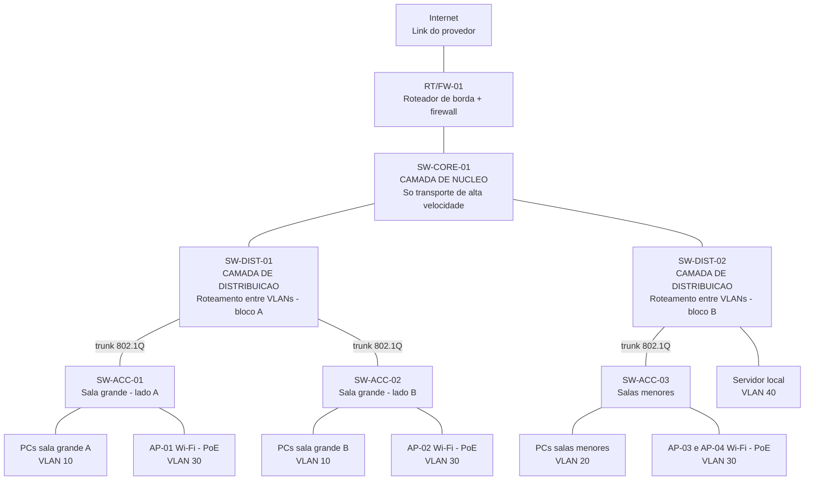
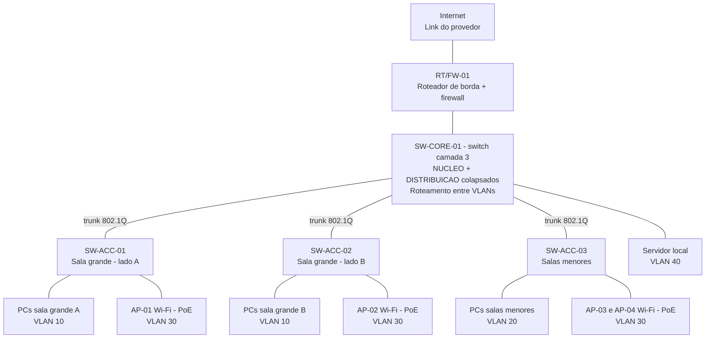

# Comutacoa-de-Redes-Locais

# Comutação de Redes Locais — Diagrama de rede hierárquico e colapsado

**Disciplina:** Comutação de Redes Locais (TCN.0639)
**Curso:** Redes de Computadores — IFRO, Campus Porto Velho Zona Norte
**Professor:** Jhordano Malacarne Bravim
**Aluno:** *Saulo Viana de Queiroz*

---

## 1. O que a atividade pedia

A partir de um cenário físico (a planta baixa de um prédio, com computadores e pontos de acesso
Wi-Fi distribuídos pelas salas), montar um diagrama de rede usando uma **estrutura hierárquica e
colapsada**.

A planta baixa mostra o espaço físico: paredes, mesas e equipamentos. O diagrama de rede mostra
outra coisa: quais equipamentos de rede existem e como eles se ligam entre si.

---

## 2. Conceitos usados

| Termo | Definição |
|---|---|
| LAN | Rede de computadores limitada a um espaço pequeno, como um prédio. |
| Switch | Equipamento que liga vários dispositivos na mesma LAN e encaminha os quadros só para a porta correta. |
| Projeto hierárquico | Modelo que divide a rede em camadas, com uma função definida para cada camada. |
| Camada de acesso | Onde os computadores e os pontos de acesso Wi-Fi se conectam. |
| Camada de distribuição | Agrega os switches de acesso e faz o roteamento entre as VLANs. |
| Camada de núcleo (core) | Transporta o tráfego em alta velocidade entre grandes blocos da rede. |
| Núcleo colapsado | Projeto em que núcleo e distribuição ficam no mesmo equipamento. Sobram dois níveis em vez de três. |
| VLAN | Divisão lógica de um switch em várias redes separadas. |
| Porta access | Porta de switch que pertence a uma única VLAN e liga um dispositivo final. |
| Porta trunk | Porta de switch que transporta várias VLANs ao mesmo tempo, com marcação IEEE 802.1Q. |
| PoE | Envio de energia elétrica pelo próprio cabo de rede (IEEE 802.3af). Usado para alimentar os pontos de acesso Wi-Fi. |

---

## 3. Leitura do cenário físico

| Área da planta | O que existe | Consequência para o projeto |
|---|---|---|
| Sala grande (esquerda) | Várias fileiras de estações de trabalho | Maior concentração de pontos de rede |
| Sala superior direita | Poucas estações de trabalho | Área administrativa, VLAN separada |
| Sala central direita | Sala pequena, sem estações | Uso definido como sala de rack |
| Sala inferior direita | Poucas estações de trabalho | Área administrativa, mesma VLAN |
| Todo o prédio | Pontos de acesso Wi-Fi | Precisam de portas de switch com PoE |

---

## 4. Modelo A — estrutura hierárquica clássica

Este modelo está aqui **para comparação**. Ele usa as três camadas em equipamentos separados.

---

## 5. Modelo B — estrutura hierárquica colapsada (solução entregue)

Este é o modelo que atende ao enunciado. O `SW-CORE-01` acumula as funções de núcleo e de
distribuição. Os switches de acesso ligam direto nele.

---

## 6. Comparação entre os dois modelos

| Item | Modelo A — 3 camadas | Modelo B — colapsado |
|---|---|---|
| Níveis | Três | Dois |
| Núcleo | Equipamento próprio | Junto com a distribuição |
| Quantidade de switches | 6 | 4 |
| Custo | Maior | Menor |
| Quando usar | Campus com vários prédios, muito tráfego | Prédio único, rede pequena ou média |
| Adequação a este cenário | Exagerado | Adequado |

---

## 7. Tabela de VLANs

| VLAN | Nome | Onde é usada |
|---|---|---|
| 10 | Laboratorio | Computadores da sala grande |
| 20 | Administrativo | Computadores das salas menores |
| 30 | WiFi | Dispositivos ligados nos pontos de acesso |
| 40 | Servidores | Servidor local |
| 99 | Gerencia | Acesso administrativo aos switches |

Os números de VLAN acima são uma escolha de projeto, não uma regra fixa. A VLAN 1 costuma ser a
VLAN padrão de fábrica dos switches, e a prática comum é não usá-la para tráfego de dados.

---

## 8. Justificativa das escolhas

1. **É hierárquico** porque cada equipamento tem uma função definida. Os switches de acesso conectam
   os dispositivos finais. O switch central agrega todos eles e faz o roteamento entre as VLANs.
2. **É colapsado** porque não existe um switch de núcleo separado. O `SW-CORE-01` acumula as funções
   de núcleo e de distribuição em um único equipamento.
3. **A escolha se justifica** porque o cenário é um prédio único, com volume de tráfego que não exige
   uma camada de núcleo dedicada. Um switch de núcleo separado aumentaria o custo sem ganho prático.
4. **O `SW-CORE-01` precisa ser de camada 3**, ou seja, precisa saber rotear. Sem isso, um computador
   da VLAN 10 não conseguiria acessar o servidor na VLAN 40.
5. **A sala grande usa dois switches de acesso** por causa da quantidade de pontos. Um switch comum
   tem 24 ou 48 portas.
6. **Os pontos de acesso Wi-Fi usam PoE**, para não depender de tomada elétrica perto do ponto de
   instalação.
7. **A expansão é simples.** Para atender uma sala nova, basta acrescentar um switch de acesso e
   ligá-lo ao `SW-CORE-01`. Isso atende ao princípio de modularidade visto em aula.

---

## 9. Domínios de colisão e de broadcast

1. Cada porta de switch operando em full-duplex forma um **domínio de colisão** separado.
2. Cada VLAN forma um **domínio de broadcast** separado.
3. Como o projeto tem 5 VLANs, existem 5 domínios de broadcast.

---

## 10. Arquivos deste repositório

| Arquivo | Conteúdo |
|---|---|
| `README.md` | Este documento |
| *VLAN Network Architecture classic* | Imagem do diagrama do modelo A |
| *VLAN Routing Architecture collapsed* | Imagem do diagrama do modelo B |

---

## 11. Ferramentas utilizadas

- **Mermaid** — para escrever os diagramas em código e gerar as imagens.
- **GitHub** — para versionar e entregar os arquivos.
